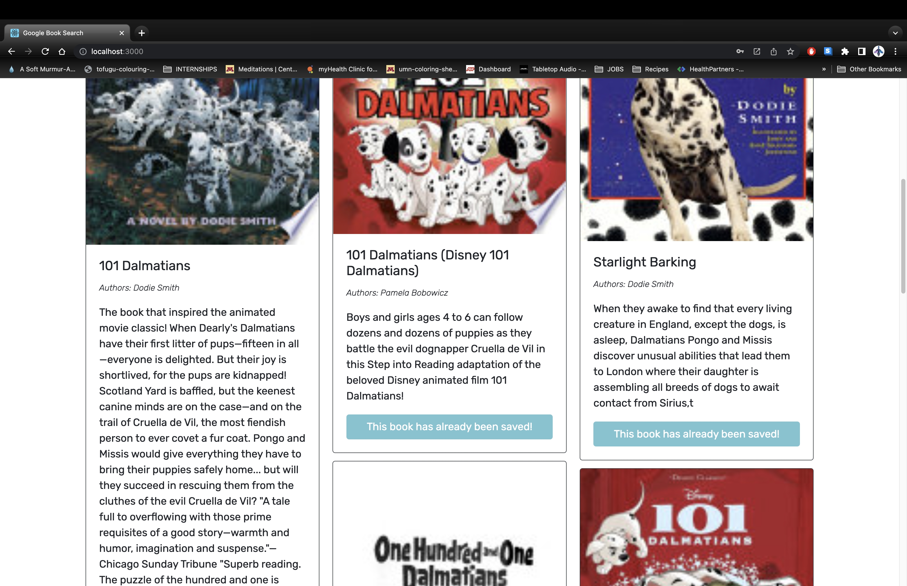
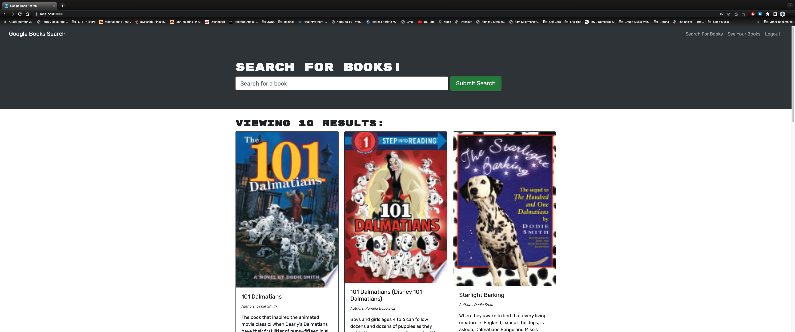
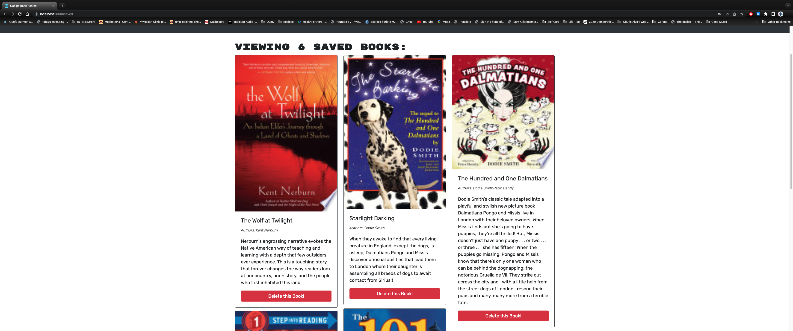
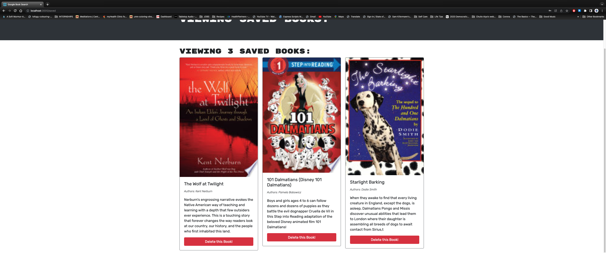

# MERN Book Search Engine

  

  ## Table of Contents
  * [Description](#description)
  * [Installation](#installation)
  * [Usage](#usage)
  * [Contributing](#contributing)
  * [Tests](#tests)
  * [Screenshots](#screenshots)
  * [Application](#application)
  * [Github](#github)
  * [Email Address](#email)
  * [Licenses](#licenses)

  
  ## Description
  This app is a google books search engine that uses a GRAPHQL API queries built with and communicates with the Apollo Server. it can be used to search for books and a user can, after creating an account, login in and search for a book, as well as save a book and delete their saved books. I refactored it to use GRAPHQL with an apollo server on the backend, as well as a Mongodb database. it is a MERN stack app and uses a REACT js front end, and express js and node.js server and API tools. 

  ## Installation
  clone the repo, then run `npm i` to install the dependecies and `npm run build` to make the build folder. user will need mongo db, express "npm i express", react, and node js. 

  ## Usage
  access through the website link. if opening locally, `npm run start` or `npm run develop`
  
  ## Licenses
  This project is covered under the MIT license. Please click on the license button to get more info.
  
  ## Contributing
  contribute things as needed
  
  ## Tests
  n/a
  
  ## Screenshots
  
   
   
   
   
   
   
   
    
   
  
   
   
   
   
 
 ## Application
 https://boiling-springs-99499.herokuapp.com/
 
  ## Github
  Have questions about this project?  
  GitHub: https://github.com/DalPenny/mod21-book-search  
  Email: dalpenny@github.io.com
